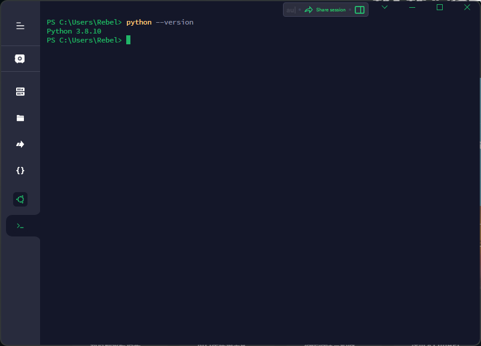
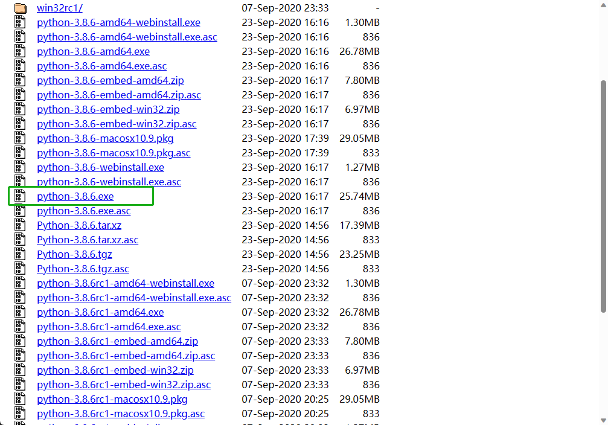
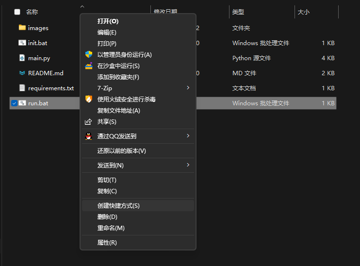
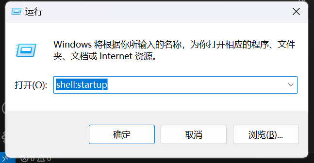
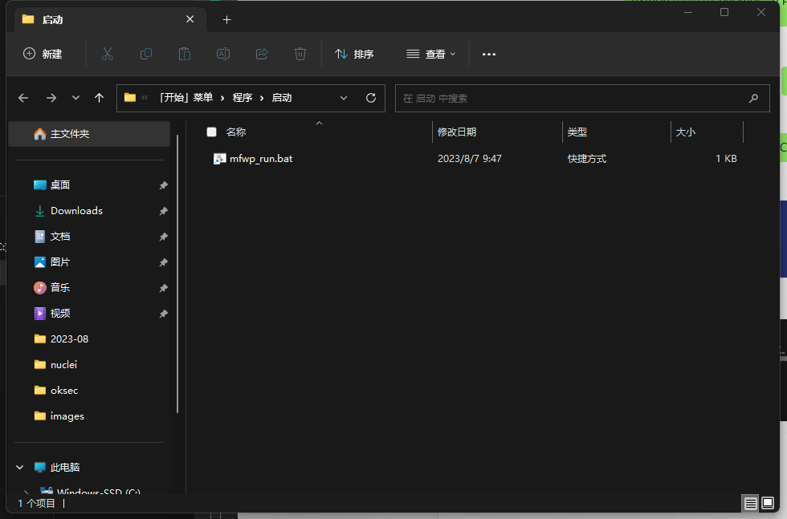

# 摸鱼人日历壁纸设置脚本


> 依赖环境：Python3 (建议 Python3.8 或以上版本)
> 
> 适用于：Windows 10 或以上 (未在 < Windows10 上测试过)

## 1. 脚本功能

1. 从 [摸鱼人日历接口](https://api.vvhan.com/moyu.html) 接口获取默认人日历图片内容 
2. 生成壁纸图片
3. 设置系统壁纸

> 感谢 [韩小韩API接口站](https://api.vvhan.com/) 的免费开放接口

## 2. 脚本使用方法

### 2.1 安装 Python3 环境

> 已有 Python3 环境的可以跳过该步骤

脚本使用 Python3 编写，所以使用前需要安装 Python3 环境

如果您不清楚自己的机器是否安装了 Python3 环境, 您可以启动一个终端, 使用以下命令检查

```sh
python --version
```



如果版本显示的是 3.x.x , 那您已经有 Python3 环境

如果没有，您需要通过以下步骤进行安装

#### 2.1.1 

前往 Python 官网下载 Python3 安装包：[https://www.python.org/downloads/windows/](https://www.python.org/downloads/windows/)

由于某些不可抗力的原因（你懂的），您可能无法访问 Python 官网，此时您可以通过国内镜像站来下载安装包：[https://registry.npmmirror.com/binary.html?path=python/3.8.6/](https://registry.npmmirror.com/binary.html?path=python/3.8.6/)



然后一路 `下一步` 即可安装成功


### 2.2 安装 Python3 依赖（初始化）

双击 `init.bat` 即可安装脚本所需依赖


### 2.3 测试

双击 `run.bat` 即可运行, 如果运行成功，壁纸将会被设置


## 3. 一些优化

### 3.1 启动时运行

您可能不想每次都双击 `run.bat` 来运行脚本设置壁纸，此时你可以使用以下步骤来为脚本设置开机启动

#### 3.1.1 创建快捷方式

右键 `run.bat` 创建快捷方式



#### 3.1.2 剪切到启动目录

`win + r` 调出 `运行` 面板

输入 `shell:startup` 并回车，进入启动项目录



把创建的快捷方式粘贴到此处

然后重命名该快捷方式为 `mfwp_run.bat` （当然不重命名也是可以的，但这样可以更好地区分该快捷方式来自哪里，这是个好习惯）




<hr />

最后，祝各位摸鱼达人周末快乐

